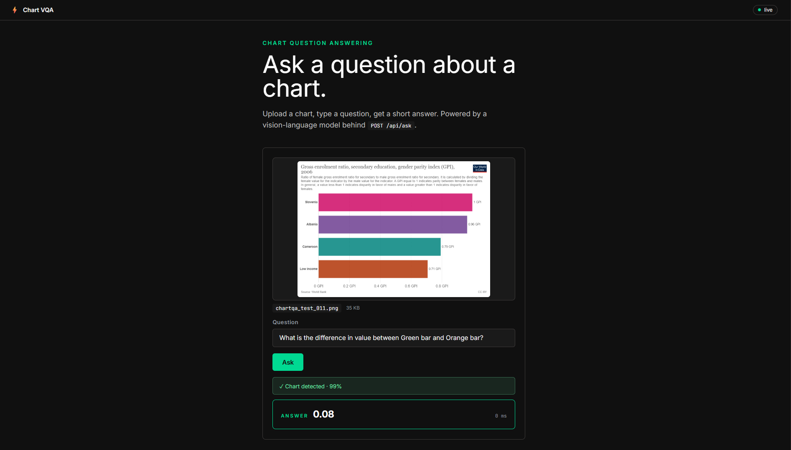

# Chartbot QA

A **production-ready multimodal AI chatbot for multi-turn question answering over
charts**: upload a chart image, then keep asking — follow-up questions, new charts, one
continuous conversation, each answer a short 1–10 word response grounded in what's on
screen. The project compares a zero-shot VLM baseline against a LoRA fine-tuned VLM on the
**ChartQA** dataset.

This repo ships the **webapp** (React UI + Flask API), built **mock-first**: the backend
returns fake answers behind a stable API contract so the UI and the safety layers can be
built and tested before the model is ready. Swapping in the real model touches a single
function (`backend/model_adapter.py::predict`). See [docs/PLAN.md](docs/PLAN.md) for the
full plan and [docs/ROBUSTNESS.md](docs/ROBUSTNESS.md) for the guard design.



## What's built

- **Webapp** — React (Vite) UI + Flask API, mock-first behind a stable `/api/ask` contract,
  real Qwen3-VL-8B (+LoRA) inference behind a single swap (`USE_MOCK=0`). Streams per-stage
  progress over SSE (`/api/ask/stream`) so the UI shows "verifying image → verifying
  question → processing model" instead of one opaque wait.
- **Multi-turn chatbot** (`conversation_store.py`) — a conversation can span several
  questions and several chart images (ChatGPT-style: "and in image 2?"), server-side
  history + images keyed by a `conversation_id`, Redis-backed (falls back to in-process,
  fail-open) with a sliding-window trim and idle TTL. With **Google sign-in** on
  (`AUTH_ENABLED=1`), each user's *current* conversation is also indexed by a **SHA-256
  hash of their Google `sub`** (never the raw id) so it survives sign-out/sign-in and page
  reloads, without ever leaking one account's chat to another.
- **Layered input guard** — screens the question/image *before* the model
  ([docs/ROBUSTNESS.md](docs/ROBUSTNESS.md) §1):
  - **Layer 1** — cheap rules (empty/junk question, image present). Always on, no extra deps.
  - **Chart gate** — **CLIP zero-shot** detector ("is this a chart?") + an OCR "has data
    values" check (Tesseract), with a pixel-heuristic fallback when CLIP/torch isn't present.
  - **Layer 2** — small local encoder classifiers: toxicity, prompt-injection, PII.
  - **Topic check** — an embedding-similarity classifier (MiniLM cosine similarity against
    reference ChartQA questions) that flags off-topic questions cheaply.
  - **Layer 3** — **Llama Guard 3** as a semantic input boundary filter for unsafe content /
    policy / jailbreak / off-topic, over an **OpenAI-compatible API** (Ollama on CPU, or
    vLLM on GPU). **Conditionally skipped**: only when Layer 2 is confidently clean (well
    below its block thresholds, not just under them) *and* the topic check is confident —
    any ambiguity still routes to Llama Guard. This cascade is the dominant latency lever:
    calling an LLM guard on every request was the single biggest cost in the whole pipeline.
  - Every layer is **fail-open**: if its model/service isn't available, the app still runs —
    it just allows the request and **logs a warning** so the gap is visible.
- **Required Google sign-in** (optional, `AUTH_ENABLED=1`) — gates `/api/ask` and friends
  behind a verified Google ID token (`backend/auth.py`); also the rate-limit key (more
  precise than a spoofable IP) and the identity behind per-user conversation history above.
- **Feedback flywheel** (`feedback_store.py`) — 👍/👎 on an answer, best-effort persisted to
  GCS (question, answer, chart image, vote) as a future fine-tuning data source.
- **Backend services** — `answer_cache.py` (fail-open LRU+TTL, short-circuits guard+chart+VLM
  on a repeat question), `uploads.py` (re-encodes/sanitizes every upload, rejects non-images),
  `metrics.py` (fail-open Prometheus: per-stage latency, request/block/cache/guard-skip
  counters), `vlm_provider.py` (the one place that decides "is the remote VLM running, should
  I start it" — shared by the page-load warm call and the real `/api/ask` path, see *Deploy*
  below), `ratelimit.py` + `budget.py` (per-IP/per-user rate limit and a daily VLM-call cap).
- **Containerized stack** — `docker-compose.yml` runs backend (Flask + CLIP + Tesseract +
  Layer-2 encoders), guard (Llama Guard 3 on CPU via Ollama), frontend (nginx serving the
  Vite build, templated so the same image works locally and on Cloud Run), and an optional
  Prometheus + Grafana observability pair with a provisioned dashboard.
- **`backend-base` / `backend` image split** — the backend's heavy deps (torch/transformers)
  and its three baked HF models (CLIP, prompt-injection, topic-check — all served only via
  HF's Xet CDN, which Cloud Build can't reach) live in a rarely-rebuilt `backend-base`
  Artifact Registry image; the deployed `backend` image is thin and `FROM` it, so a normal
  code deploy rebuilds in ~2 minutes instead of reinstalling ML deps every time. Mirrors the
  `vlm-base`/`vlm-service` split below. Build it once with
  `scripts/gcloud_build_backend_base.sh` (see `backend/models/README.md`).
- **GPU model serving, two environments, one `server.py`** (`vlm_service/`) — a small Flask
  wrapper around the shared `QwenVLChat` class, warm-loaded once at boot: **RunPod** pods
  for cheap SSH-accessible dev/debugging (`scripts/runpod_up.py` / `runpod_down.py`, a bare
  venv install over SSH, no image — see [docs/RUNPOD_NOTES.md](docs/RUNPOD_NOTES.md)), and
  **Cloud Run GPU** (scale-to-zero, `nvidia-l4`) for production, built as **two images**
  split at the changes-rarely/changes-often line — `vlm-base` (CUDA/deps + the baked
  ~17.5 GB model, rebuilt only on a dependency/model bump,
  `scripts/gcloud_build_vlm_base.sh`) and a thin `vlm-service` `FROM` it (code + adapter +
  config, redeployed in minutes via `scripts/gcloud_deploy_vlm.sh`) — see
  [docs/VLM_IMAGE_SPLIT.md](docs/VLM_IMAGE_SPLIT.md).
- **MLOps** (`modeling/`) — an installable `chartqa` package: LoRA fine-tuning + evaluation +
  error analysis for **Qwen3-VL-8B** and **BLIP-2**, with **MLflow** experiment tracking
  (params, accuracy, latency, peak VRAM, adapter size) and a bitsandbytes **quantization
  study** (4-bit/8-bit accuracy vs cost) driving the model's serving-cost decision.

## Quickstart

Two ways to run — full design in [docs/ARCHITECTURE.md](docs/ARCHITECTURE.md).

### Production (default) — containerized

```bash
git clone <repo> && cd Chartbot-QA
python app.py
```

`python app.py` runs the **production stack in Docker**: the **backend** container (Flask +
CLIP + Tesseract + Layer-2 encoders, all baked into the image) and the **guard** container
(Llama Guard 3 on **CPU via Ollama**, model baked in), plus a **local Vite frontend**. On
first run it creates `.env` from `.env.example`, runs `npm install`, builds the images (slow
the first time — it compiles the ML stack), and starts everything. Open **http://localhost:5173**.
`AUTH_ENABLED=0` and `USE_MOCK=1` by default in `.env.example` — no Google sign-in wall and
no real model call, so the multi-turn chat UI works immediately with mock answers. Set
`USE_MOCK=0` for real inference (needs `VLM_URL` or an in-process GPU) and `AUTH_ENABLED=1`
+ `GOOGLE_CLIENT_ID` to require sign-in and get per-user persisted chat history.

**Prerequisites:** **Docker Desktop** (running) and **Node.js 18+**. **No GPU and no host
Ollama** — the guard runs on CPU inside its container. If Docker isn't running, `app.py`
**warns and stops** (use `--dev` instead).

### Local dev — no Docker

```bash
python app.py --dev
```

Runs the backend in a local **Python 3.12 venv** (CLIP + Layer-2 models), guards local, and the
Vite frontend — bootstrapping the venv, models, `npm install` and `.env` on first run.
**Prerequisites:** Python 3.12 + Node.js 18+. For **Layer 3** in dev, point `GUARD_LLM_URL` at
any OpenAI-compatible guard — e.g. start just the containerized guard with `docker compose up
guard` (served on `localhost:11434`). Without one, Layer 3 fails open and warns; set
`GUARD_LLM_ENABLED=0` to disable it intentionally. Light setup: `python app.py --dev --no-guard`.

## Configuration (`.env`)

All knobs live in a root **`.env`** file (created from [`.env.example`](.env.example) on first
run; gitignored). The backend loads it at startup via `python-dotenv`. **Every key is required —
the backend has no in-code defaults**, so `.env.example` is the canonical list. Real shell env
vars take precedence. Highlights:

| Var | Example | Meaning |
| --- | --- | --- |
| `USE_MOCK` | `1` | `0` calls the real model (`model_adapter.predict`) |
| `GUARD_LLM_ENABLED` | `1` | Layer-3 Llama Guard on; falls back + warns if unreachable |
| `GUARD_LLM_URL` | `http://localhost:11434` | OpenAI-compatible guard endpoint (dev) |
| `GUARD_LLM_MODEL` | `llama-guard3:1b` | guard model tag |
| `TOPIC_CHECK_ENABLED` | `1` | embedding-similarity off-topic check (part of the Layer-3 skip cascade) |
| `TESSERACT_CMD` | *(empty)* | path to the Tesseract binary; empty = use `PATH` |
| `AUTH_ENABLED` | `0` | `1` requires Google sign-in on `/api/ask` and co.; needs `GOOGLE_CLIENT_ID` |
| `CONVERSATION_ENABLED` | `1` | multi-turn chat state (history + images per `conversation_id`) |
| `CONVERSATION_TTL_S` | `1800` | idle expiry for a conversation (refreshed on every turn) |
| `REDIS_URL` | *(empty)* | shared cache/rate-limit/conversation state across instances; empty = in-memory |
| `PORT` / `HOST` | `5000` / `127.0.0.1` | backend bind |

In **production** (`python app.py`), `docker-compose.yml` **overrides** a few of these for the
backend container — `GUARD_LLM_URL=http://guard:11434` (the guard service), `HOST=0.0.0.0`,
`FLASK_DEBUG=0`, `TESSERACT_CMD=` (apt binary on `PATH`) — so the same `.env` works for both modes.

## Architecture

```
image + question (+ optional Google ID token, + optional conversation_id)
      │
      ▼
 (Auth)        AUTH_ENABLED=1 → verify Google ID token, else 401     (skipped if off)
      │
      ▼
 Conversation  known conversation_id (or restored via the user's own token) → follow-up:
               history + prior images re-hydrated; else: turn 1, image required
      │
      ▼
 Input Guard   L1 rules → chart gate (CLIP + OCR) → L2 encoders + topic check
      │                        │ both confident-clean/on-topic? skip ↓, else ↓
      │                        ▼
      │                   L3 Llama Guard (semantic safety + off-topic net)    (fail-open)
      │ allowed
      ▼
answer_cache   repeat, turn-1, no-history (image, question)? → short-circuit to cached answer
      │ miss
      ▼
   Model (VLM)   mock, OR in-process, OR HTTP to vlm_service (RunPod dev / Cloud Run prod)
      │
      ▼
 short answer  → appended to the conversation; conversation_id returned for the next turn
```

In **production** this is CPU containers — **backend** (Flask + CLIP + Tesseract + L2),
**guard** (Llama Guard), **frontend** (nginx) — wired by `docker-compose.yml`, plus the
**GPU model service** (`vlm_service/`) reached over HTTP at `VLM_URL` (never in the CPU
image). The CPU gatekeeper — auth + conversation + guards + chart gate + cache — always
runs; only a request that survives all of it ever reaches the billed GPU. See
[docs/ARCHITECTURE.md](docs/ARCHITECTURE.md), the
[deploy validation report](docs/CPU_DEPLOY_REPORT.md), and *Deploy & MLOps* below.

- **frontend/** — React + Vite UI: question box, image picker, multi-turn chat transcript,
  Google sign-in, 👍/👎 feedback; nginx in prod.
- **backend/** — Flask API (`/api/ask`, `/api/ask/stream`, `/api/conversation`,
  `/api/feedback`, `/api/health`, `/metrics`), auth, the multi-turn conversation store, the
  chart gate + layered guard, the answer cache, mock/remote inference routing. Deployed as
  a thin image `FROM` the rarely-rebuilt `backend-base` (see *What's built*).
- **guard/** — Dockerfile for the CPU Llama Guard (Ollama) image, model baked in.
- **vlm_service/** — standalone GPU Flask service (Qwen3-VL-8B + LoRA), the real-model
  serving path — see *Deploy & MLOps*.
- **modeling/** — the `chartqa` package: fine-tuning, evaluation, MLflow tracking — see
  *Deploy & MLOps*.
- **scripts/** — deploy automation: `runpod_up.py`/`runpod_down.py` (dev GPU pods),
  `gcloud_build_vlm_base.sh`/`gcloud_build_backend_base.sh` (rare — the two `*-base`
  images), `gcloud_deploy_vlm.sh`/`gcloud_deploy_guard.sh`/`gcloud_deploy_app.sh` (Cloud
  Run, every deploy).
- **observability/** — Prometheus scrape config + a provisioned Grafana dashboard.
- **app.py** — orchestrator: `python app.py` (prod, Docker) / `python app.py --dev` (local) /
  `python app.py --dev --runpod` (local + a real GPU model on a RunPod dev pod).

## Deploy & MLOps

**Model development** (`modeling/`, see [modeling/README.md](modeling/README.md)) — LoRA
fine-tunes **Qwen3-VL-8B** and **BLIP-2 Flan-T5-XL** on ChartQA, with **MLflow** tracking
every run's params/accuracy/latency/VRAM, and error analysis comparing zero-shot vs
fine-tuned failure modes. A **quantization study** (4-bit/8-bit via bitsandbytes) answers
the actual production question — does the accuracy hold up cheap enough to serve — and
directly drove the choice below (8B doesn't fit a 6 GB consumer GPU at 4-bit; it needs a
real GPU host either way, so the serving design assumes that from the start).

**Serving the real model** (`vlm_service/`) is a small, boring Flask app: load the model
once at boot, `POST /predict {image, question} → {answer}`. The interesting part is that
**the same Docker image runs unmodified in two very different places**:

| | RunPod (dev) | Cloud Run GPU (prod) |
| --- | --- | --- |
| Why | real SSH access — the only way the version-pinning/CUDA/cuDNN issues below were debuggable at all | managed scale-to-zero — no shell access, but no idle billing or manual teardown either |
| Automated by | `scripts/runpod_up.py` (fresh pod → upload → install → launch → SSH tunnel → prints `VLM_URL`) / `runpod_down.py` | `scripts/gcloud_build_vlm_base.sh` (once, rare) then `scripts/gcloud_deploy_vlm.sh` (Cloud Build → Artifact Registry → `gcloud run deploy --gpu=1 --gpu-type=nvidia-l4 --min-instances=0`) |
| Cost model | pay-per-second, bills continuously while running — needs explicit teardown (idle watchdog + signal traps built in) | true scale-to-zero — no cost while idle |

Every real fix needed to get a clean GPU environment working — pinned torch/torchvision
version pairs, `HF_HOME`/pip-cache placement, PEP 668 quirks — is written up in
[docs/RUNPOD_NOTES.md](docs/RUNPOD_NOTES.md) so they don't get rediscovered.

The CPU app and the GPU model deploy **independently** (`gcloud_deploy_app.sh` vs
`gcloud_deploy_vlm.sh`) — an app change never rebuilds the multi-GB CUDA image. `GET
/api/vlm/warm` (called by the frontend on page load) and the real `/api/ask` path both go
through `backend/vlm_provider.py`, the single place that decides whether the model needs
a nudge to start — so a RunPod dev pod and a Cloud Run instance are handled by one code
path, not two.

### Production topology (Cloud Run)

Four independently-deployed Cloud Run services, each its own container/image, each scaled
and billed separately — a small service-oriented setup, not a monolith. Cost drove the
split as much as modularity: the two expensive pieces (GPU model, and its own build cache)
scale to zero and are locked down so only the backend can reach them.

```
 Browser
    │  HTTPS + Google ID token (required sign-in)
    ▼
 ┌─────────────────────┐   /api/*   ┌──────────────────────┐
 │  chartqa-frontend    │──────────▶│  chartqa-backend       │
 │  nginx · PUBLIC       │           │  Flask · PUBLIC        │
 │  serves the Vite build│           │  L1 rules + chart gate │
 └─────────────────────┘           │  + L2 encoders + cache │
                                     │  rate-limit / budget   │
                                     └──────────┬─────────────┘
                                                │  Google-signed ID token
                                    ┌───────────┴────────────┐
                                    ▼                         ▼
                        ┌──────────────────────┐  ┌──────────────────────┐
                        │  chartqa-guard         │  │  chartqa-vlm           │
                        │  Ollama · PRIVATE       │  │  GPU nvidia-l4·PRIVATE │
                        │  Guard Layer 3          │  │  FROM vlm-base         │
                        │  (Llama Guard 3 1B)     │  │  (adapter+code, thin)  │
                        └──────────────────────┘  └──────────┬─────────────┘
                                                              │ FROM (build time only —
                                                              │ never deployed/running)
                                                   ┌──────────┴─────────────┐
                                                   │  vlm-base                │
                                                   │  build-cache image:      │
                                                   │  CUDA/deps + baked model │
                                                   │  rebuilt rarely          │
                                                   └──────────────────────┘

 chartqa-backend also talks to Upstash Redis (rediss://, external) for rate-limit /
 daily VLM budget / answer-cache / conversation-history state shared across backend
 instances, and to Google's OAuth2 endpoints to verify sign-in ID tokens.
```

- **Public** (`--allow-unauthenticated`): `chartqa-frontend`, `chartqa-backend` — the demo
  surface.
- **Private** (`--no-allow-unauthenticated`, backend calls via a Google-signed ID token
  fetched from the Cloud Run metadata server, `backend/gcp_auth.py`): `chartqa-guard`,
  `chartqa-vlm` — the two paths that cost real money per call, so nothing but the backend
  can invoke them.
- **`vlm-base` is not a Cloud Run service at all** — it's an Artifact Registry image that
  `chartqa-vlm`'s Dockerfile is `FROM`. It exists purely so a normal `chartqa-vlm` redeploy
  doesn't re-download the 17.5 GB base model every time (see
  [docs/VLM_IMAGE_SPLIT.md](docs/VLM_IMAGE_SPLIT.md)).
- Deploy order: `gcloud_build_vlm_base.sh` (once) → `gcloud_deploy_vlm.sh` →
  `gcloud_deploy_guard.sh` → `gcloud_deploy_app.sh --vlm-url … --guard-url … --redis-url …
  --google-client-id …` — see the `gcloud-deploy` skill / `docs/REVIEW_AND_ROADMAP.md` §3.7.

## API

Base URL (dev): `http://127.0.0.1:5000`

| Method | Path | Body | Response |
| --- | --- | --- | --- |
| GET | `/api/health` | — | `{ "status": "ok", "mock": true }` |
| POST | `/api/ask` | `multipart/form-data`: `image=<file>` (optional on a follow-up), `question=<string>`, `conversation_id=<string>` (optional) | `{ "answer"\|"disclaimer": "...", "mock": true, "is_chart": true, "chart_confidence": 0.99, "latency_ms": 0.0, "conversation_id": "...", "image_index": 1 }` |
| POST | `/api/ask/stream` | same body as `/api/ask` | `text/event-stream`: one `data: {"stage": ..., "status": "start"\|"done", ...}` line per pipeline stage, ending with `{"stage": "result", "body": <the /api/ask JSON above>, "status_code": 200}` — same pipeline, real-time progress |
| GET | `/api/conversation` | — (auth required) | `{ "conversation_id": "..."\|null, "messages": [...] }` — the signed-in user's current conversation, if any |
| POST | `/api/feedback` | JSON/form: `conversation_id`, `vote` (`"up"\|"down"`), `note` (optional) | `{ "status": "ok" }` — best-effort, fire-and-forget |
| GET | `/api/vlm/warm`, `/api/guard/warm` | — (auth required) | `{ "status": "ok" }` — fire-and-forget nudge so a scale-to-zero service's cold start overlaps the user's think-time |
| GET | `/metrics` | — | Prometheus text format |

`image` is **required on turn 1**, optional on a follow-up (the backend re-hydrates prior
images from the conversation store by `conversation_id`) — omit both `image` and
`conversation_id` and, when signed in, the backend transparently resumes *your own* most
recent conversation. In **mock mode** (default), `/api/ask` returns a `disclaimer` instead
of a fake `answer` (set `MOCK_REVEAL=1` to get the canned answer, or `USE_MOCK=0` for the
real model). If the guard **blocks** the question it returns **HTTP 200** with
`{ "blocked": true, "category": "...", "reason": "..." }`. Bad input returns `400` with
`{ "error": "..." }`. Uploads are capped at `MAX_UPLOAD_MB` (10 MB). When `AUTH_ENABLED=1`,
every endpoint above except `/api/health` and `/metrics` requires
`Authorization: Bearer <Google ID token>` and returns `401` without one.

```bash
curl http://127.0.0.1:5000/api/health
curl -F "question=What was revenue in 2024?" -F "image=@chart.png" http://127.0.0.1:5000/api/ask
```

## Useful flags

```bash
python app.py                            # PRODUCTION: containers (backend + guard) + local frontend
python app.py --dev                      # LOCAL DEV: venv backend + CLIP + Vite, no Docker
docker compose down                      # stop the production containers

# dev-mode flags (with --dev):
python app.py --dev --no-guard           # light setup: skip the heavy Layer-2 guard models
python app.py --dev --backend-only       # just the Flask API
python app.py --dev --frontend-only      # just the Vite dev server
python app.py --dev --setup-only         # install deps + print guard readiness, then exit
python app.py --dev --no-setup           # skip the dependency check (faster restarts)
```

## Tests

```bash
cd backend
.venv/Scripts/python.exe -m pip install -r requirements-dev.txt   # once  (macOS/Linux: .venv/bin/python)
.venv/Scripts/python.exe -m pytest
```

Tests run **without** any guard models or Ollama — the guard HTTP/model calls are monkeypatched,
so CI stays fast and green on a clean machine.

## Swapping the mock for the real model

Inference goes through one seam — the model team only touches **`backend/model_adapter.py`**:

1. Implement `predict(image_bytes: bytes, question: str) -> str` (add runtime deps to
   `backend/requirements.txt`).
2. Set `USE_MOCK=0` in `.env` (or env). `backend/inference.py` only imports the adapter when
   `USE_MOCK` is off, so the app boots in mock mode without any ML deps. No frontend/API changes.

## Project layout

```
Chartbot-QA/
├── app.py                # orchestrator: prod (docker compose) / --dev (local venv) / --dev --runpod
├── docker-compose.yml    # prod stack: backend + guard + frontend + prometheus + grafana
├── .env.example           # config template -> copied to .env (gitignored) on first run
├── backend/
│   ├── Dockerfile          # THIN: FROM backend-base, just the app source (fast rebuilds)
│   ├── Dockerfile.base     # heavy deps (torch/transformers) + baked HF models; rebuilt rarely
│   ├── app.py              # Flask API: /api/ask(/stream), /api/conversation, /api/feedback, ...
│   ├── auth.py             # Google ID token verification (AUTH_ENABLED)
│   ├── conversation_store.py  # multi-turn history + images + per-user restore index (Redis/in-mem)
│   ├── env_config.py       # required-env helpers (no in-code config defaults)
│   ├── inference.py        # run_inference() seam; mock vs real (USE_MOCK)
│   ├── model_adapter.py    # predict() landing spot: in-process or HTTP to vlm_service
│   ├── vlm_provider.py     # shared "is the remote VLM running, should I start it" logic
│   ├── answer_cache.py     # fail-open LRU+TTL cache, short-circuits guard+chart+VLM
│   ├── ratelimit.py / budget.py  # per-IP/user rate limit + daily VLM-call cap
│   ├── uploads.py          # image re-encode/sanitize before anything else touches it
│   ├── feedback_store.py   # 👍/👎 flywheel, best-effort persisted to GCS
│   ├── metrics.py          # fail-open Prometheus: per-stage latency + counters
│   ├── chart_check.py      # chart gate: CLIP zero-shot + OCR "has data", heuristic fallback
│   ├── guard.py            # Layer 2 orchestrator (toxicity / injection / PII) + warmup()
│   ├── guard_llm.py        # Layer 3: Llama Guard over the OpenAI /v1 API (Ollama / vLLM)
│   ├── topic_check.py      # embedding-similarity off-topic classifier (part of the L3-skip cascade)
│   ├── models/             # gitignored: CLIP/injection/topic-check weights baked into backend-base
│   └── tests/              # pytest: API contract, guard logic, vendor-sync, quantization config
├── guard/          # CPU Llama Guard via Ollama, model baked into the image
├── frontend/       # React + Vite app (chat UI, Google sign-in); nginx.conf.template (local + Cloud Run)
├── vlm_service/    # GPU model service (Qwen3-VL-8B+LoRA): server.py + TWO images —
│                   #   Dockerfile.base (deps+model, built rarely) and the thin
│                   #   Dockerfile (FROM base, code/adapter/config, built every deploy)
├── modeling/       # chartqa package: fine-tuning, evaluation, MLflow tracking, quant study
├── scripts/        # runpod_up.py/runpod_down.py, gcloud_build_vlm_base.sh /
│                   #   gcloud_build_backend_base.sh (rare — the two *-base images),
│                   #   gcloud_deploy_vlm.sh/gcloud_deploy_guard.sh/gcloud_deploy_app.sh
├── observability/  # Prometheus config + provisioned Grafana dashboard
└── docs/           # ARCHITECTURE.md, ROBUSTNESS.md, REVIEW_AND_ROADMAP.md, RUNPOD_NOTES.md, ...
```

## Team

- **Victor** — full webapp ownership: the Flask backend and its services (inference
  routing, answer cache, upload sanitization, Prometheus metrics), the React frontend,
  containerization of the whole stack (docker-compose: backend/frontend/guard/
  observability), and the deploy/MLOps tooling — MLflow tracking, the quantization
  study, and the RunPod-dev / Cloud-Run-GPU-prod serving automation described above.
  Within the layered input guard, Victor owns the **question/text side** — Layer 1
  rules, the Layer-2 toxicity/prompt-injection/PII encoders, and the Layer-3 Llama
  Guard integration (`guard.py`, `guard_llm.py`).
- **Min** — webapp pair-programming with Victor, focused on the **image side** of input
  validation: the chart gate (`chart_check.py` — CLIP zero-shot + OCR "has data"
  detector) and its container image.
- **Susanne & Omar** — model choice, architecture, and LoRA fine-tuning, focused on the
  experimentation side (Qwen3-VL-8B vs BLIP-2, hyperparameters, error analysis);
  integrated into the app via the single `model_adapter.predict` seam.
